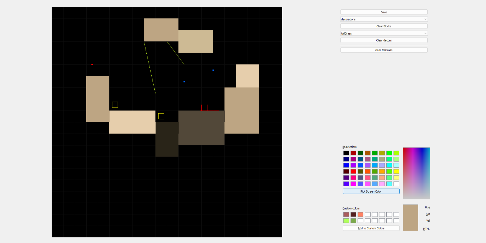
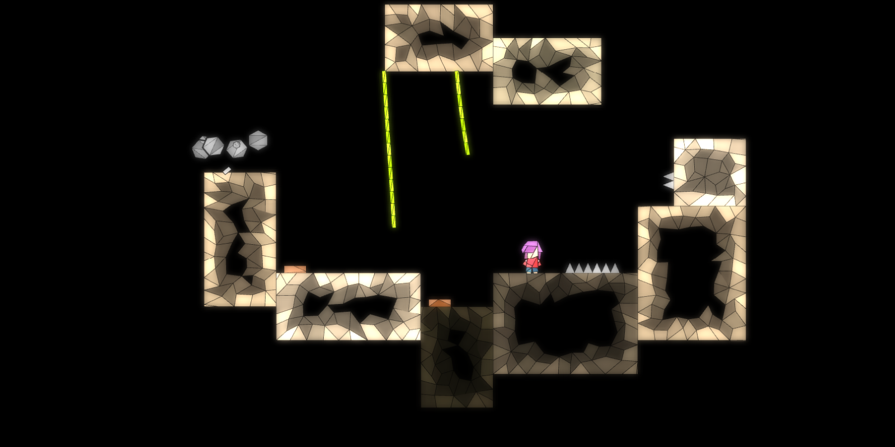

# reflect level editor

|                                           |                                       |
| ----------------------------------------- | ------------------------------------- |
|  |  |

simple level editor for [reflect](https://github.com/nprze/reflect).\
made using python with PyQt5.\
supports platform blocks, action blocks, and decorations
